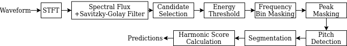

# sf-ha-onsetdetection

  

GuitarSet

|                     | F-score | Precision | Recall |
|---------------------|---------|-----------|--------|
| CNN Onset Detector  | 0.84   | 0.78     | 0.92  |
| GuitarOnsetDetector |   0.71      |    0.95       |    0.59  |
| SF-HA               | 0.84   | 0.89     | 0.81  |

Music Critic Dataset 

|                     | F-score | Precision | Recall |
|---------------------|---------|-----------|--------|
| CNN Onset Detector  | 0.70   | 0.59     | 0.92  |
| GuitarOnsetDetector |   0.80      |    0.80       |    0.80  |
| SF-HA               | 0.85   | 0.86     | 0.84  |

GuitarSet: https://github.com/marl/GuitarSet  
Annotation of the music critic dataset is done with https://github.com/srvrc/Sound-Annotator  

                                 GuitarSet                    Music Critic Dataset
| Chord Files         | F-score | Precision | Recall | -  | F-score | Precision | Recall |
|---------------------|---------|-----------|--------| - |---------|-----------|--------|
| CNN Onset Detector  | 0.82   | 0.78     | 0.88          || 0.59     | 0.46  | 0.93 | 
| GuitarOnsetDetector |   0.69      |    0.95  |    0.56  ||  0.74      |    0.74  |    0.74  |
| SF-HA               | 0.81   | 0.91     | 0.76          || 0.84 |  0.84     | 0.85  |

                                 GuitarSet                    Music Critic Dataset
| Solo Files         | F-score | Precision | Recall | -  | F-score | Precision | Recall |
|---------------------|---------|-----------|--------| - |---------|-----------|--------|
| CNN Onset Detector  | 0.86   | 0.79     | 0.95          || 0.78     | 0.69  | 0.92 | 
| GuitarOnsetDetector |   0.73      |  0.95  |    0.60  ||  0.85      |    0.86  |    0.84  |
| SF-HA               | 0.86   | 0.88     | 0.86          || 0.85 |  0.88     | 0.84  |
